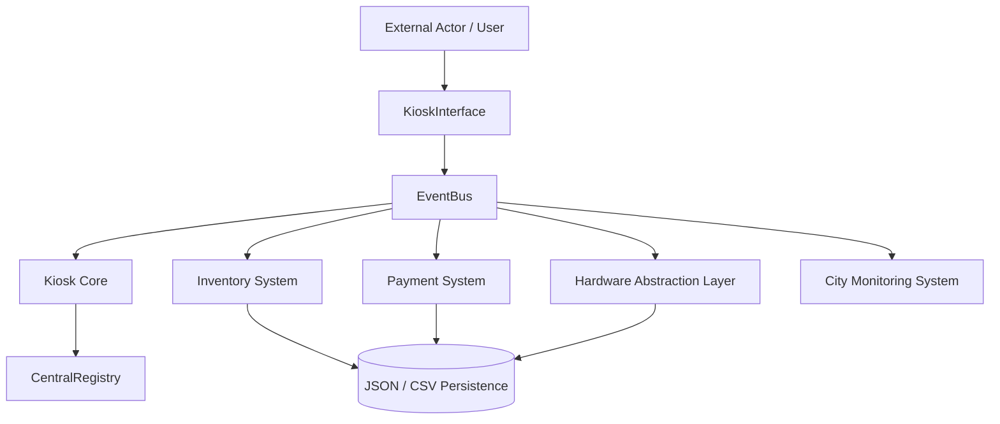
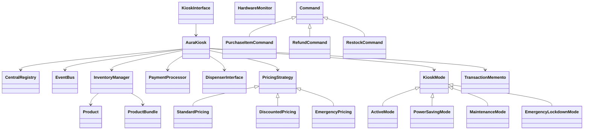
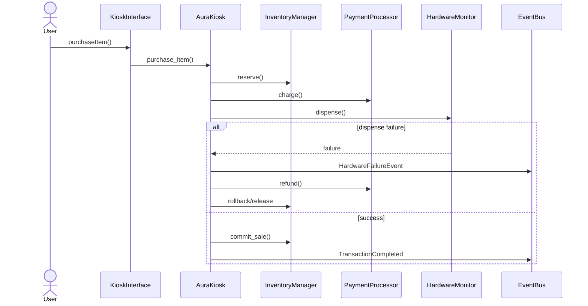

# UML Diagrams

## 1. High-Level Architecture Diagram

```mermaid
flowchart TD
    User[External Actor / User] --> Facade[KioskInterface]
    Facade --> Bus[EventBus]
    Bus --> Core[Kiosk Core]
    Bus --> Inv[Inventory System]
    Bus --> Pay[Payment System]
    Bus --> HW[Hardware Abstraction Layer]
    Bus --> City[City Monitoring System]
    Core --> Reg[CentralRegistry]
    Inv --> Persist[(JSON / CSV Persistence)]
    Pay --> Persist
    HW --> Persist
```

## 2. Class Diagram

```mermaid
classDiagram
    class CentralRegistry
    class EventBus
    class AuraKiosk
    class KioskInterface
    class InventoryManager
    class PaymentProcessor
    class HardwareMonitor
    class DispenserInterface
    class PricingStrategy
    class KioskMode
    class Command
    class TransactionMemento
    class Product
    class ProductBundle

    KioskInterface --> AuraKiosk
    AuraKiosk --> CentralRegistry
    AuraKiosk --> EventBus
    AuraKiosk --> InventoryManager
    AuraKiosk --> PaymentProcessor
    AuraKiosk --> DispenserInterface
    AuraKiosk --> PricingStrategy
    AuraKiosk --> KioskMode
    AuraKiosk --> TransactionMemento
    InventoryManager --> Product
    InventoryManager --> ProductBundle
    Command <|-- PurchaseItemCommand
    Command <|-- RefundCommand
    Command <|-- RestockCommand
    PricingStrategy <|-- StandardPricing
    PricingStrategy <|-- DiscountedPricing
    PricingStrategy <|-- EmergencyPricing
    KioskMode <|-- ActiveMode
    KioskMode <|-- PowerSavingMode
    KioskMode <|-- MaintenanceMode
    KioskMode <|-- EmergencyLockdownMode
```

## 3. Sequence Diagram — Purchase Flow

```mermaid
sequenceDiagram
    actor User
    participant UI as KioskInterface
    participant Kiosk as AuraKiosk
    participant Inv as InventoryManager
    participant Pay as PaymentProcessor
    participant HW as HardwareMonitor
    participant Bus as EventBus

    User->>UI: purchaseItem()
    UI->>Kiosk: purchase_item()
    Kiosk->>Inv: reserve()
    Kiosk->>Pay: charge()
    Kiosk->>HW: dispense()
    alt dispense failure
        HW-->>Kiosk: failure
        Kiosk->>Bus: HardwareFailureEvent
        Kiosk->>Pay: refund()
        Kiosk->>Inv: rollback/release
    else success
        Kiosk->>Inv: commit_sale()
        Kiosk->>Bus: TransactionCompleted
    end
```
